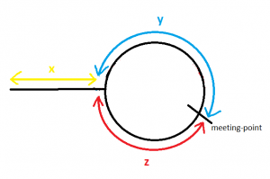

* Hash Table
    * Use an array as a hash table
        * If 1 &lt;= a[i] &lt;= n (_n = size of array_), you can use the element as keys.
            * Ex) [442. Find All Duplicates in an Array](https://leetcode.com/problems/find-all-duplicates-in-an-array/)
* Sorting
    * If sorted, try to use binary search O(log n)
    * Sorting Jagged Array
        ```cs
        // arr = [[1,100][11,22][1,11][2,12]]

        // [[1,100][1,11][2,12][11,22]]
        var sortedArr1 = arr.OrderBy(x => x[0]).ToArray();

        // [[1,11][2,12][11,22][1,100]]
        var sortedArr2 = arr.OrderBy(x => x[1]).ToArray();

        // [[1,100][11,22][2,12][1,11]]
        var sortedArr3 = arr.OrderBy(x => x[0] - x[1]).ToArray();
        
        // [[2,12][1,11][11,22][1,100]]
        var sortedArr4 = arr.OrderBy(x => x[1] - x[0]).ToArray();
        ```
        * Ex)
            * [435. Non-overlapping Intervals](https://leetcode.com/problems/non-overlapping-intervals/)
            * [1029. Two City Scheduling](https://leetcode.com/problems/two-city-scheduling/)

* Cycle Detection
    * Floyd's Tortoise and Hare

        

        [source](https://web.archive.org/web/20160401024212/http://learningarsenal.info:80/index.php/2015/08/24/detecting-start-of-a-loop-in-singly-linked-list/)

        ```cs
        public void FloydsAlgorithm()
            {
            int[] arr = new int[] { 1, 2, 3, 4, 5, 6, 3 };
            /*  1 -> 2 -> 3 -> 4 
            *             ^    |  
            *             |    v  
            *             6 <- 5     
            */


            int tortoise = arr[arr[0]], hare = arr[arr[arr[0]]];

            // Tortoise travels x + y
            // Hare travels x + y + z + y = x + 2y + z
            // Find the meeting point
            while (tortoise != hare)
            {
                tortoise = arr[tortoise];
                hare = arr[arr[hare]];
            }

            // bring the tortoise back to beginning
            tortoise = arr[0];

            // tortoise travels x
            // Hare travels z
            while (tortoise != hare)
            {
                tortoise = arr[tortoise];
                hare = arr[hare];
            }

            Console.WriteLine("Cycle starts at: " + tortoise);           

            // To find the length of cycle
            hare = arr[tortoise];
            int length = 1;

            while (tortoise != hare)
            {
                hare = arr[hare];
                length++;
            }

            Console.WriteLine("Length: " + length);
        }
        ```
    * Ex)
        * [287. Find the Duplicate Number](https://leetcode.com/problems/find-the-duplicate-number/)


