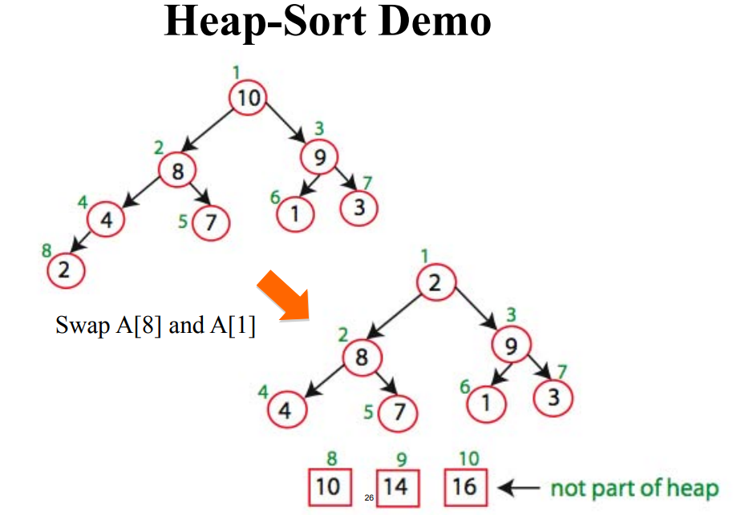

## Priority Queue
- A data structure implementing a set _S_ of elements, each associated with a key, supporting the following operations:
    - For examples:
        - Supporse you must schedule jobs according to their importance relative to other jobs.
        - Scheduling the jobs requires sorting them by importance, and then evaluating them in this sorted order.
- It is much more cost-effective to insert a new job into a priority queue than to re-sort everything on each such arrival. 

- insert(_S, x_): insert element _x_ into set _S_
- max(_S_): return element of _S_ with largest key
- extract_max(_S_): return element of _S_ with largest key and remove it from _S_
- increase_key(_S, x, k_): increase the value of element _x_'s key to new value _k_ (assumed to be as large as current value)

## Heap
- Running Time= O(n log n)
- Implementation of a priority queue
- It is an array, but visualized as a nearly complete binary tree.
    - You have to go down and do a number of steps and that is number of this tree => log n

    
- Max Heap Property: The key of a node is >= than the keys of its children
    - Index 1 >= Index 2 and Index 3 >= ... 
    - Index 6,7,8,9,10 don't have children so don't care.
- Min Heap Property: Opposite.

### Heap as a Tree
- Root of tree: First element in the array, corresponding to i = 1
- Parent(i) = i/2: returns index of node's parent
- left(i) = 2i: returns index of node's left child
- right(i) = 2i+1: returns index of node's right child

### Heap Operations
- build_max_heap: produce a max-heap from an unordered array
- max_heapify: correct a single violation of the heap property in a subtree at its root
    - Assume that the trees rooted at left(i) and right(i) are max-heaps
    - If element A[i] violates the max-heap property, correct violation by "trickling" element A[i] down the tree, making the subtree rooted at index _i_ a max-heap

        
        
        

### Build Max and Min Heap
- Converts A[1...n] to a max heap
- Start at n / 2
    - Because elements A[n/2+1 ... n] are all leaves of the tree 2i > n, for i > n/2 + 1

        
        
        

## Heap-Sort
- O(n log n)

1. Build Max (or min) heap from unordered array.
2. Find maximum element A[0];
3. Swap element A[n-1] and A[0]
4. Discard node n-1 from heap (by decrementing heap-size variable)
5. New root may violate max heap property, but its children are max heaps. Run MaxHeapify to fix this
6. Go to step 2 unleass heap is empty


    
    
    
    


```cs
static void Main(string[] args)
{
    int[] arr = { 55, 25, 89, 34, 12, 19, 78, 95, 1, 100 };
    
    AscendingHeapSort(arr);
    // After AscendingHeapSort(arr): 1, 12, 19, 25, 34, 55, 78, 89, 95, 100
    DescendingHeapSort(arr);
    // After DescendingHeapSort(arr): 100, 95, 89, 78, 55, 34, 25, 19, 12, 1
}

static void AscendingHeapSort(int[] arr)
{
    int n = arr.Length;
    for (int i = n / 2; i >= 0; i--)
        MaxHeapify(arr, n, i);
    for (int i = n - 1; i >= 0; i--)
    {
        Swap(arr, 0, i);
        MaxHeapify(arr, i, 0);
    }
}

static void MaxHeapify(int[] arr, int n, int i)
{
    int largest, left = 2 * i, right = 2 * i + 1;
    if (left < n && arr[left] > arr[i])
        largest = left;
    else
        largest = i;
    if (right < n && arr[right] > arr[largest])
        largest = right;
    if (largest != i)
    {
        Swap(arr, i, largest);
        MaxHeapify(arr, n, largest);
    }
}

static void DescendingHeapSort(int[] arr)
{
    int n = arr.Length;
    for (int i = n / 2; i >= 0; i--)
        MinHeapify(arr, n, i);
    for (int i = n - 1; i >= 0; i--)
    {
        Swap(arr, 0, i);
        MinHeapify(arr, i, 0);
    }
}

static void MinHeapify(int[] arr, int n, int i)
{
    int smallest, left = 2 * i, right = 2 * i + 1;
    if (left < n && arr[left] < arr[i])
        smallest = left;
    else
        smallest = i;
    if (right < n && arr[right] < arr[smallest])
        smallest = right;
    if (smallest != i)
    {
        Swap(arr, i, smallest);
        MinHeapify(arr, n, smallest);
    }
}

static void Swap(int[] arr, int i, int j)
{
    int tmp = arr[i];
    arr[i] = arr[j];
    arr[j] = tmp;
}
```
    


    
    