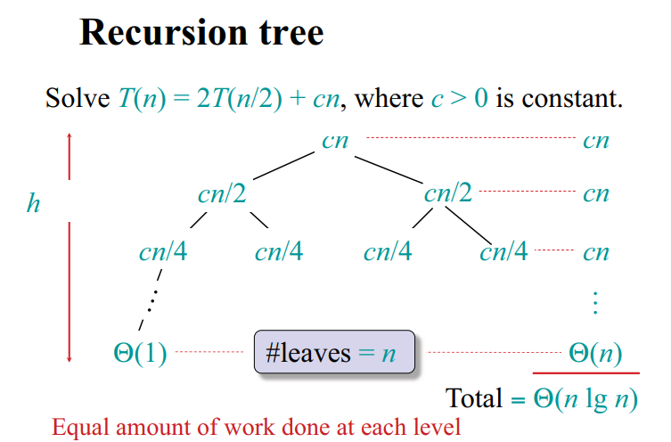

## _O(n<sup>2</sup>)_ algorithms

### Insertion Sort
- Running Time: &Theta;(n<sup>2</sup>) because &Theta;(n<sup>2</sup>) compares and &Theta;(n<sup>2</sup>) swaps
    - &Theta;(n) steps (Key Position) and each step is &Theta;(n) Compares & Swaps
- &Theta;(1) auxiliary space (In-place sorting)
```cs
// arr = 1,3,2,6,4,5,2,3,32,12,4 => 1,2,2,3,3,4,4,5,6,12,32
public void InsertionSort(int[] arr)
{
    for (int i = 1; i < arr.Length; i++)
    {
        int j = i;
        while (j > 0 && arr[j] < arr[j - 1])
        {
            Swap(arr, j - 1, j);
            j--;
        }
    }
}

public void Swap(int[] arr, int i, int j)
{
    int tmp = arr[i];
    arr[i] = arr[j];
    arr[j] = tmp;
}
```

### Bubble Sort
- Running Time: O(n<sup>2</sup>): "It turns out that the time complexity of such an algorithm is _always_ at least _O(n<sup>2</sup>)_, because in the worst case, _O(n<sup>2</sup>)_ swaps are required for sorting the array. (CSES p.26)
- &Theta;(1) auxiliary space (In-place sorting)
```cs
public void BubbleSort(int[] arr)
{
    for (int i = 0; i < arr.Length; i++)
    {
        for (int j = 0; j < arr.Length - 1; j++)
        {
            if (arr[j] > arr[j + 1])
                Swap(arr, j, j + 1);
        }
    }
}

public void Swap(int[] arr, int i, int j)
{
    int tmp = arr[i];
    arr[i] = arr[j];
    arr[j] = tmp;
}
```

## _O(n log n)_ algorithms

### Merge Sort
- Running Time: &Theta;(n log n)
    - It halves the size of the subarray at each step. The recursion consists of _O(log n)_ levels, and processing each level takes _O(n)_ time. Mergin the subarrays array[a...k] and array[k+1...b] is possible in linear time, because they are already sorted.

        

- &Theta;(n) auxiliary space

```cs
public void MergeSort(int[] arr, int left, int right)
{
    if (left < right)
    {
        int middle = left + (right - left) / 2;

        MergeSort(arr, left, middle);
        MergeSort(arr, middle + 1, right);

        Merge(arr, left, middle, right);
    }
}

public void Merge(int[] arr, int left, int middle, int right)
{
    int[] leftArray = new int[middle - left + 1];
    int[] rightArray = new int[right - middle];

    Array.Copy(arr, left, leftArray, 0, middle - left + 1);
    Array.Copy(arr, middle + 1, rightArray, 0, right - middle);

    int leftArrayIndex = 0, rightArrayIndex = 0;

    for (int i = left; i <= right; i++)
    {
        if (leftArrayIndex == leftArray.Length)
            arr[i] = rightArray[rightArrayIndex++];

        else if (rightArrayIndex == rightArray.Length)
            arr[i] = leftArray[leftArrayIndex++];

        else if (leftArray[leftArrayIndex] <= rightArray[rightArrayIndex])
            arr[i] = leftArray[leftArrayIndex++];

        else
            arr[i] = rightArray[rightArrayIndex++];
    }
}
```

### using LINQ
```cs
// nums = 1, 5, 9, 1, 5, 9

var sorted = nums.Select((value, index) => new { value, index }).OrderBy(x => x.value).ToArray();
// <int, int>
// value = 1, index = 0
// value = 1, index = 3
// value = 5, index = 1
// value = 5, index = 4
// value = 9, index = 2
// value = 9, index = 5

for (int i = 0; i < sorted.Length; i++)
{
    // value, index
    int a = sorted[i].value, b = sorted[i].index;
}
```